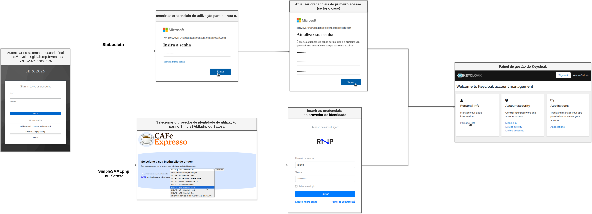
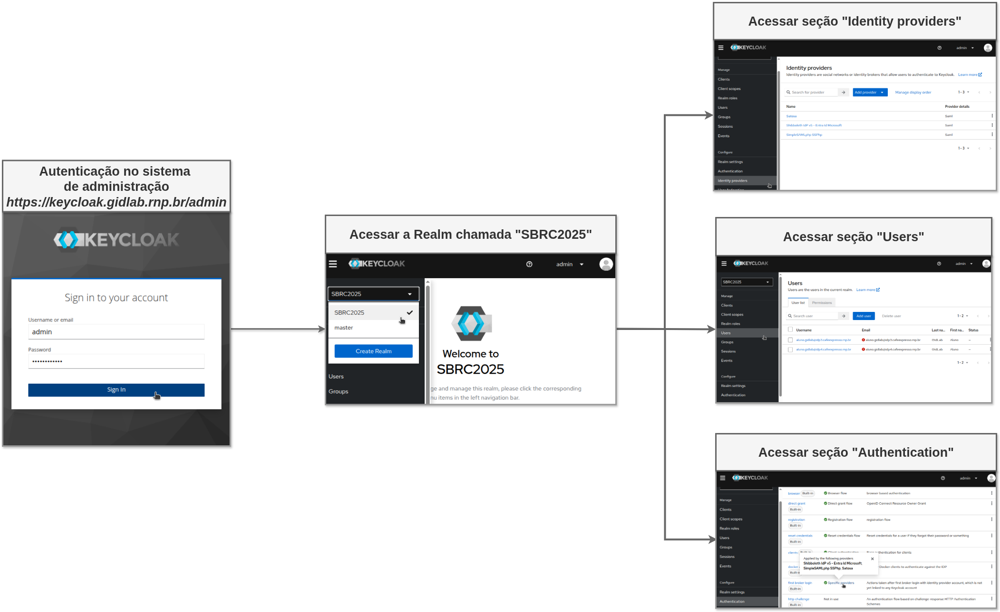

<!-- omit in toc -->

# Testbed para Proxies de Gestão de Identidades: Uma Análise Prática do Shibboleth, SimpleSAMLphp e SATOSA

Este repositório contém as documentações e orientações do ambiente de experimentação descrito no artigo **Testbed para Proxies de Gestão de Identidades: Uma Análise Prática do Shibboleth, SimpleSAMLphp e SATOSA**.

<!-- omit in toc -->

## 📚 Sumário

- [Testbed para Proxies de Gestão de Identidades: Uma Análise Prática do Shibboleth, SimpleSAMLphp e SATOSA](#testbed-para-proxies-de-gestão-de-identidades-uma-análise-prática-do-shibboleth-simplesamlphp-e-satosa)
  - [📚 Sumário](#-sumário)
  - [🎯 Ambiente de Experimentação](#-ambiente-de-experimentação)
    - [⚙️ Ambiente de configuração](#️-ambiente-de-configuração)
    - [👤 Ambiente do usuário final](#-ambiente-do-usuário-final)
  - [🔐 Contas de Utilização para os Proxies](#-contas-de-utilização-para-os-proxies)
    - [Entra ID](#entra-id)
    - [SimpleSAMLphp e SATOSA](#simplesamlphp-e-satosa)
  - [🔁 Exemplo de Fluxo](#-exemplo-de-fluxo)
  - [📖 Guia Completo de Instalação e Configuração](#-guia-completo-de-instalação-e-configuração)
    - [Ordem Recomendada](#ordem-recomendada)
    - [Resumo dos Guias Disponíveis](#resumo-dos-guias-disponíveis)
  - [🧩 Configuração costumizada de instância de proxies](#-configuração-costumizada-de-instância-de-proxies)
    - [Shibboleth com Microsoft Entra ID](#shibboleth-com-microsoft-entra-id)
    - [SimpleSAMLphp](#simplesamlphp)
    - [SATOSA](#satosa)
  - [🧩 Configuração costumizada do ambiente de degustação](#-configuração-costumizada-do-ambiente-de-degustação)

## :dart: Ambiente de Experimentação
> :warning: Para acessar o ambiente de experimentação, *é necessário solicitar credenciais pelo e-mail atendimento@rnp.br*. 
> Ao solicitar, informe se o acesso é para o *ambiente de administração*, *ambiente de degustação* ou ambos.

### :gear: Ambiente de administração
1. Acesse: https://keycloak.gidlab.rnp.br.
2. Clique em *Administration Console*.
3. Insira as credenciais administrativas recebidas por e-mail.
4. No canto superior esquerdo, altere a *REALM* de master para SBRC2025.

### :bust_in_silhouette: Ambiente de degustação
1. Acesse: https://keycloak.gidlab.rnp.br/realms/SBRC2025/account/#/.
2. Escolha o proxy desejado em *Or sign in with*.
3. Insira as credenciais do proxy, previamente solicitadas por e-mail.

### SimpleSAMLphp e SATOSA

> Utilizam os mesmos provedores de identidade: **IdP3** e **IdP4**.

| Provedor | Usuário | Senha        |
| -------- | ------- | ------------ |
| IdP3     | `aluno` | `aluno@idp3` |
| IdP4     | `aluno` | `aluno@idp4` |

## 🔁 Exemplo de Fluxo

A figura abaixo exemplifica o fluxo de autenticação utilizando os proxies. Ao selecionar a opção Satosa na tela inicial do Keycloak, o usuário é redirecionado para o serviço de descoberta da federação CAFe Expresso. Em seguida, escolhe um dos provedores de identidade disponíveis (neste caso, o IdP3) e realiza o login com suas credenciais, completando assim o fluxo.

<p align="center"></p>

Fluxo no Keycloak

<p align="center"></p>

## 📖 Guia Completo de Instalação e Configuração

Para garantir a correta reprodução do ambiente, é importante seguir uma ordem específica de configuração.  
⚠️ **Antes de configurar o Keycloak, é necessário instalar e configurar os proxies de identidade.**

### Ordem Recomendada

1. **Instalação e Configuração dos Proxies**

   - Shibboleth (com Microsoft Entra ID)
   - SimpleSAMLphp
   - SATOSA

2. **Instalação e Configuração do Ambiente de Degustação**
   - Keycloak
   - Relação de Confiança com os Proxies

### Resumo dos Guias Disponíveis

- 📂 **`guias/Guia_Instalação_Shibboleth_5.md`**  
  Explica como instalar o Shibboleth 5 e integrá-lo ao Entra ID.

- 📂 **`guias/Guia_Configuração_do_Azure_com_Shibboleth_5.md`**  
  Detalha o processo de configuração do Azure para integração com o Shibboleth.

- 📂 **`guias/Guia_de_Instalação_e_Configuração_do_SimpleSAMLphp_como_proxy_SAML.md`**  
  Passo a passo de instalação do SimpleSAMLphp e configuração como proxy SAML.

- 📂 **`guias/Guia_Instalação_Satosa.md`**  
  Guia de instalação e configuração inicial do SATOSA.

- 📂 **`guias/Guia_Instalação_Keycloak.md`**  
  Mostra como instalar o Keycloak para o ambiente de degustação.

- 📂 **`guias/Guia_Relação_de_Confiança.md`**  
  Explica como estabelecer a relação de confiança entre Keycloak e os proxies.

---

## 🧩 Configuração costumizada de instância de proxies

Esta seção apresenta tutoriais independentes para que você possa configurar de forma costumizada e testar os proxies abordados no artigo.

- Para a grande maioria dos proxies (como Shibboleth e SATOSA), **não é necessário gerar certificados manualmente**, pois eles são criados automaticamente durante o processo de instalação.
- ⚠️ **No caso do SimpleSAMLphp, é necessário gerar manualmente os certificados X.509** que serão usados pelo Apache e pelo proxy SAML.

### Shibboleth com Microsoft Entra ID

1. [Guia de Instalação do Shibboleth 5](./guias/Guia_Instalação_Shibboleth_5.md)
2. [Guia de Configuração do Azure com Shibboleth 5](./guias/Guia_Configuração_do_Azure_com_Shibboleth_5.md)

### SimpleSAMLphp

1. [Guia de Instalação e Configuração do SimpleSAMLphp como proxy SAML](./guias/Guia_de_Instalação_e_Configuração_do_SimpleSAMLphp_como_proxy_SAML.md).
2. Editar o arquivo `simplesamlphp-config/default-ssl.conf`.
3. Criar o diretório `certs-apache`, acessar esse diretório:

   ```bash
   mkdir certs-apache
   cd certs-apache
   ```

4. Gere a chave privada e o certificado X.509 autoassinado (válido por 10 anos, por exemplo):

   ```bash
   openssl req -newkey rsa:2048 -new -x509 -days 3650 -nodes \
   -out saml.crt -keyout saml.pem
   ```

5. fazer o build

   ```bash
   docker build .
   ```

6. Subir o container:

   ```bash
   docker compose up
   ```

### SATOSA

1. [Guia de Instalação do SATOSA](./guias/Guia_Instalação_Satosa.md)

## 🧩 Configuração costumizada do ambiente de degustação

1. [Guia de Instalação do Keycloak](./guias/Guia_Instalação_Keycloak.md)
2. [Guia de Relação de Confiança](./guias/Guia_Relação_de_Confiança.md)

> 💡 Para mais detalhes sobre os casos de uso e fluxos de autenticação com cada proxy, consulte o artigo completo em PDF incluso neste repositório.

